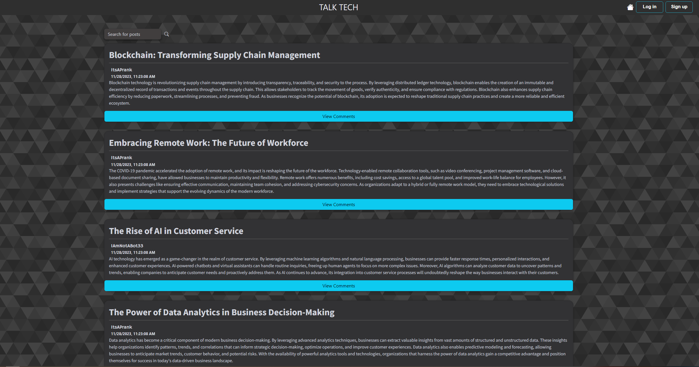

  
# Tech-Blog

## Desccription
This is the week 14 challenge for the UC Berkeley Coding Bootcamp. The goal of this project was to create a CMS-style blog site similar to a Wordpress site, where developers can publish their blog posts and comment on other developers’ posts as well. This site was built using the Model-View-Controller paradigm and uses Handlebars.js as the templating language, Sequelize as the ORM, and the express-session npm package for authentication.

## Usage
The homepage displays all of the blog posts that have been created. If the user is not logged in, they will be prompted to log in or sign up when they try to add a comment. If the user is logged in, they will be able to add a comment to any of the posts.

The dashboard displays all of the posts that have been created by the logged in user. The user can click on any of the posts to edit or delete them. The user can also create a new post by clicking on the "New Post" button.

## Credits
- Kim for helping debug https://github.com/charmingdarling
- Clarice for helping debug https://github.com/Clkwong3

## License
This project is open source and available under the [MIT](./LICENSE)